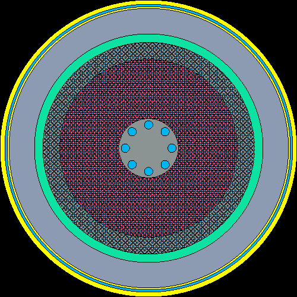
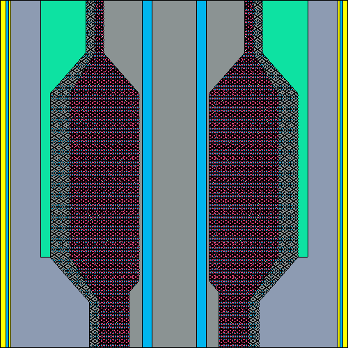
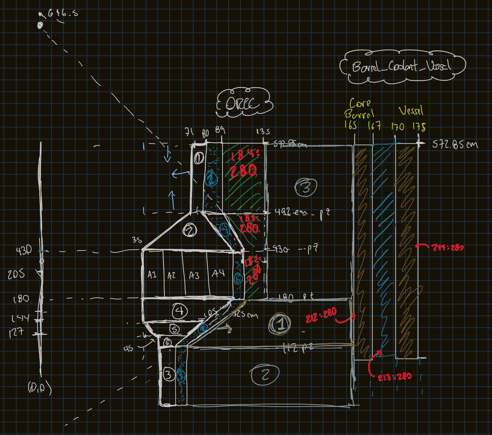

# FHR Inputs - Commented Version

There are two directories here:

## FHR_TRISO_INFO

This directory contains the inputs for an FHR infinite lattice of triso particles.


## FHR_CORE 

Inputs for the FHR core taken from LOOK FOR SOURCE. Differences include formatting and added comments for better understanding. 


The following is from the original `readme` file:

```
Has rods? [False, False, False, False]
Packing fraction 0.600000
Same fuel composition in multi fuel zones? True
Combined triso coatings into one layer? False
Coolant temperature 923.150000
Fuel temperature 1073.150000
Fuel type fresh
Has shield? False
```




All files have been commented and can be better undrestood with the help of the following diagram:




